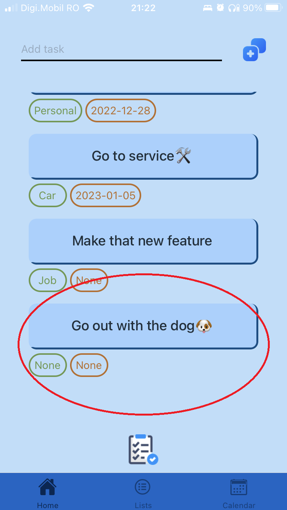
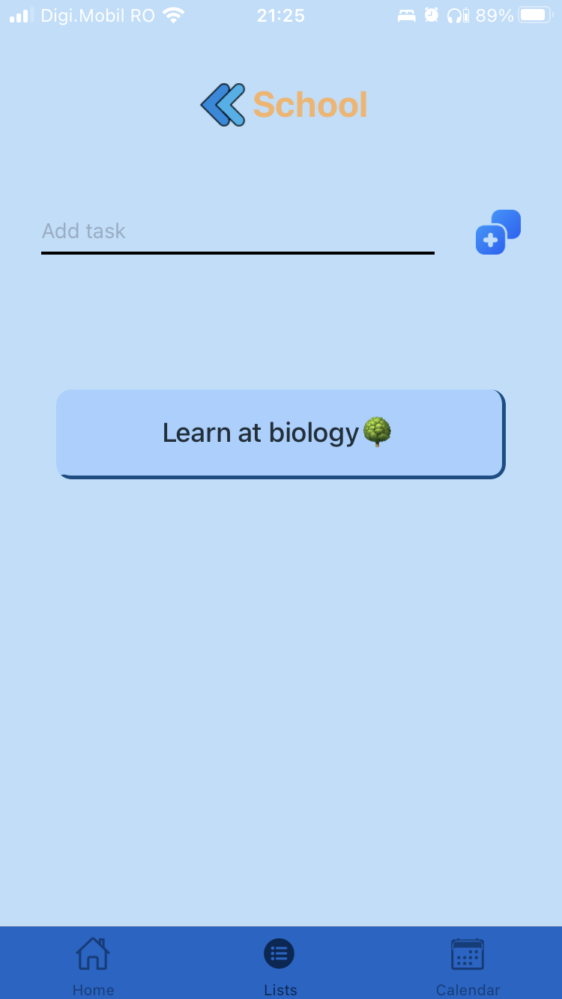

# Doing is living - *a to do app for everyone*

The app purpose is to help you remember and keep track of your doings and help me gain some experience with React Native and Javascript.
It contains three screens(as you can see below): **Home** , **Lists** and **Calendar**. On each screen the user can create different tasks, edit those tasks, complete or delete them.

  
  
  

 

---

# Home Screen

All the tasks appear on the **Home** screen, even if the task is created in other screens. The user have the possibility to add new tasks from the home screen, but they will not be attributed to the list or planned to a specific date. 

  
  
  

 

Although the user can edit the tasks(name, list and/or a planned day) by swiping the task to the *right* and press on the **Edit** button:

  
  
  

 

The user can also delete a task by swiping *right* and pressing the **Delete** button:

  
  

 
  
Or he can complete the task by swiping *left* and pressing **Done**:

  

 
  
All the completed tasks are accessible by pressing the button at the end of the page. The user will be redirected to the **Completed tasks** screen, where he can see his project.

  

 
 
Below is a presentation of the **Home** screen:

   
---

# Lists Screen
  
A to do application wouldn't be complete without the possibility to group the tasks into lists. Here the user can create a specific list and acces it for creating tasks.
  

  
  

 
  
To acces the list the user needs to swipe *left* and press the **Open** button. The button will redirect the user to the specific list where all the tasks with that list tag will be displayed.
  

  
  

 

Also the user can **Edit** or **Delete** the list, the same way as he would edit or delete a task:

  
  
  

 
  
Below is a presentation of the **Lists** screen:

  
  
  
  
  
  
